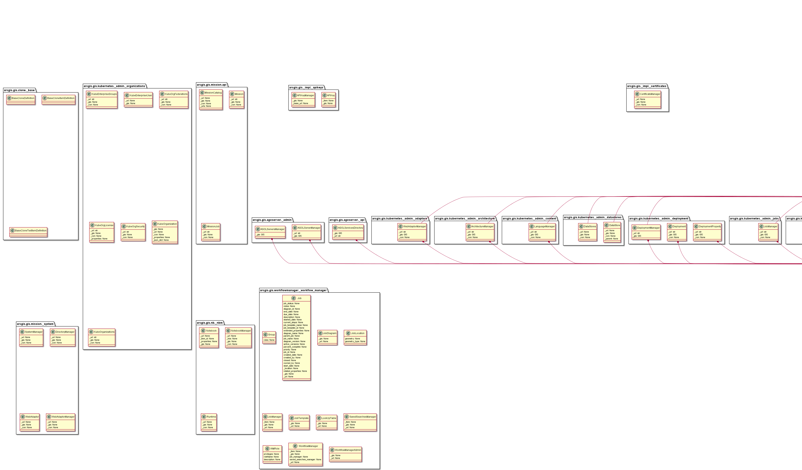

# arcgis-api-to-class-diagrams
A demonstration of how to convert the ArcGIS API for Python to PlantUML (PUML) and then to class diagrams.

## ArcGIS API for Python to PlantUML.ipynb
A notebook to create PUML files from a Python package directory.

## PUML Files
PUML files for the ```arcgis``` paackage classes.

## out
A folder containing class diagrams for the ```arcgis``` site package. For example, this is the ```gis``` class diagram.

